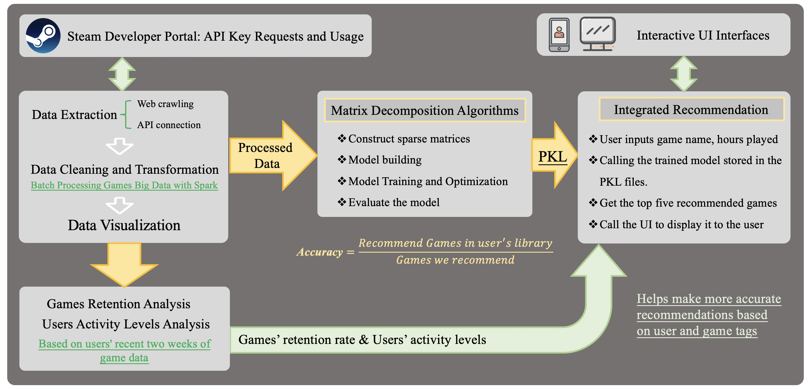
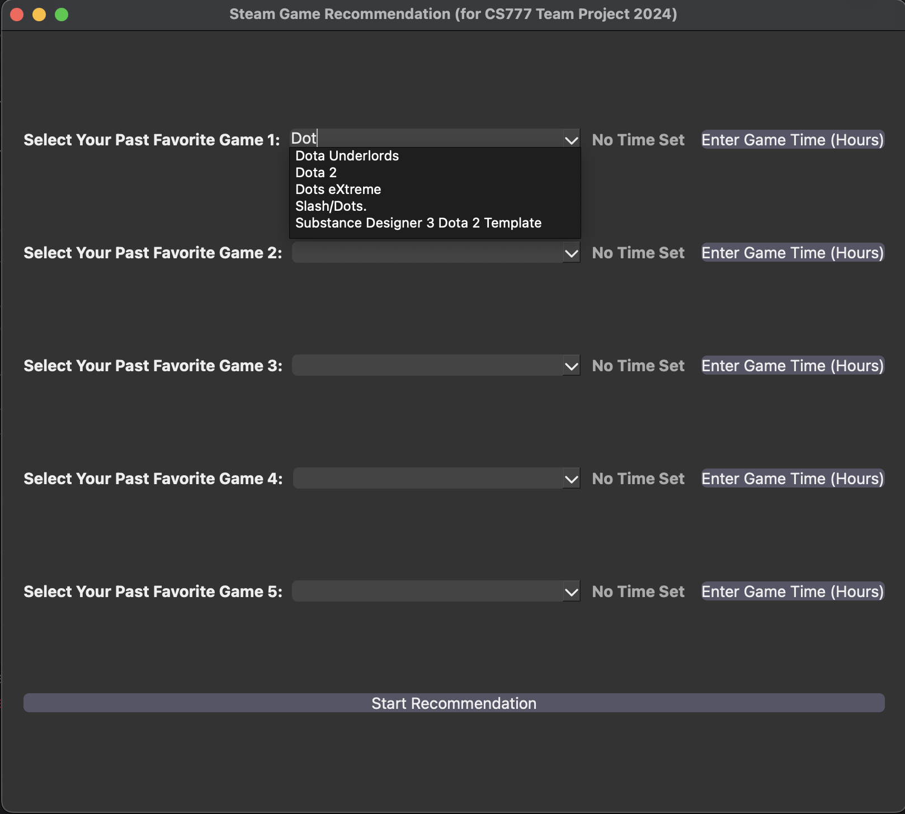
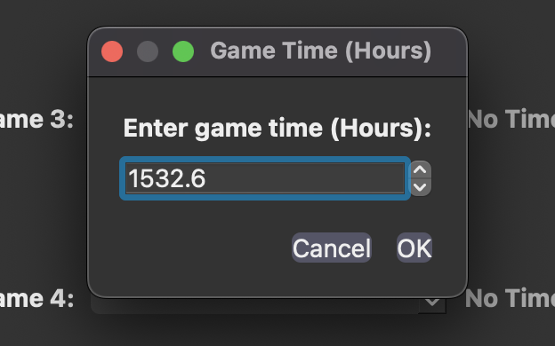
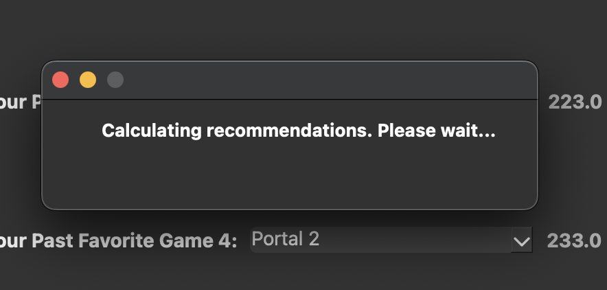
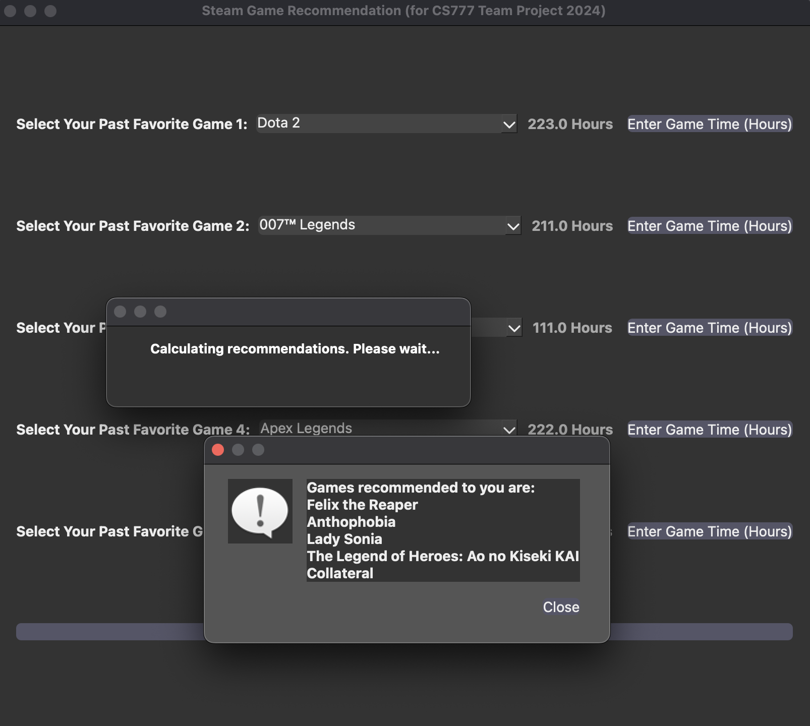

# Steam Game Recommendation System
### <u>*Author:</u> [Shuaijun Liu: — Click here to go to my Personal Web Page](https://shuaijun-liu.github.io/)

<p align="center">

</p>

## 1. Overview

### 1.1 Introduction

This README outlines a multi-phase Project aimed at extracting, processing, and analyzing user and game data from Steam, followed by constructing and deploying a sophisticated machine learning-based game recommendation system. Each step involves specific tools, methodologies, and insights aimed at understanding user behavior and improving game recommendations.

**Keywords: Recommendation System, Spark, Web Crawler, Big Data Analysis**

### 1.2 Primer
Welcome to our Steam Game Recommendation System project!  Before you start, you need to make sure that all the necessary preparations have been completed.
1. [Environment Setup Guide](Guide/Installing_Required_Packages.md)
2. [Steam API Usage Guide](Guide/Steam_API_Usage.md)
3. [Web Scraping with Selenium Guide](Guide/Web_Scraping_with_Selenium.md)

You can click on the links above to jump to the appropriate Guide.

## 2. Architecture

<p align="center">

</p>

### 2.1 Data Extraction and Preprocessing

#### 2.1.1 User ID Collection
To access user's detailed data via Steam's API, we have to get the user's Steam ID first. Therefore, we have to use **BeautifulSoup and Regular Expression** to parse and search the Steam Members page([https://steamcommunity.com/games/steam/members?p=page_num](https://steamcommunity.com/games/steam/members)) for active players(online or in game). And then naviagte to users' profile pages to fetch their SteamID.

- **Scraping Strategy**: Python scripts, leveraging the `requests` and `BeautifulSoup` libraries, navigate through the Steam community’s user pages. These scripts extract profile URLs and use regular expressions to systematically gather Steam user IDs.
- **Reliability Techniques**: The `safe_request` function is designed with robust error handling capabilities, featuring retries with increasing delays (exponential back-off) and logging for troubleshooting.

Core Function:
```python
def get_all_user_ids(member_list_page_no, user_ids):
    """
    Retrieves user IDs from multiple pages of the member list.

    Args:
        member_list_page_no (int): The total number of member list pages to process.
        user_ids (list): List to store user IDs.
    """
    for idx in range(1, member_list_page_no + 1):
        print(f"Processing Member List {idx}...")
        url = f"https://steamcommunity.com/games/steam/members?p={idx}"
        resp = requests.get(url)
        if resp.status_code == 200:
            soup = bs(resp.text, 'html.parser')
            all_users = soup.find_all("div", onclick=re.compile(r"top\.location\.href='https:\/\/steamcommunity\.com\/id\/(\w+)'"), class_=re.compile(r"online|in-game|offline"))
            for user in all_users:
                user_profile = user.div.div.div.a['href']
                get_user_id(user_profile, user_ids)
        else:
            print(f"HTTP Error {resp.status_code} while fetching member list {idx}")
```
The user id data is stored in the file: [Data/user_ids.json](Data/user_ids.json)
```json
["76561197960434622", "76561197972495328", "76561198028573551", "76561197970323416", "76561198007695232", "76561197970565175", "76561197968459473", "76561198024187698", 
  "76561197980258575", "76561198000175595", "76561198015158492", "76561197993258642", "76561197972978861", "76561198106631362", "76561198150708893", "76561198059745288", 
  "76561198030442423", "76561197993715298", "76561198077131365", "76561198278664273", "76561198072796930", "76561198102302108", "76561197990067826", "76561198076780091", 
  "76561198109429966", "76561198128232705", "76561198067064616", "76561197972179036", "76561198089451726", "76561197999523214", "76561198025851571", "76561198031477597", 
  "76561197983060858", "76561198085734037", "76561198046981778"...
```

#### 2.1.2 Game Data Retrieval
- **Steam API Interaction**: Scripts use the Steam API key to fetch data. This includes making authenticated requests to endpoints that provide details on user game ownership, playtime, and activity.
- **Data Structuring**: Data from the API is deserialized from JSON format and validated using schemas to ensure integrity before it is stored into structured JSON files, facilitating straightforward access for further analysis.

Core Function:
```python
if __name__ == '__main__':
    key = 'ED8D8EE8F67DD482E78FD7CEFC3CC6DE'
    user_ids_file = '/Users/a1234/Desktop/workspace/Steam_Recommendation_System_777_tp/Data/user_ids.json'

    with open(user_ids_file) as f:
        user_ids = json.load(f)

    base_url_owned_games = 'http://api.steampowered.com/IPlayerService/GetOwnedGames/v0001/?key=' + key
    base_url_recently_played_games = 'http://api.steampowered.com/IPlayerService/GetRecentlyPlayedGames/v0001/?key=' + key

    dump_user_info(base_url_owned_games, user_ids, '/Users/a1234/Desktop/workspace/Steam_Recommendation_System_777_tp/Data/user_owned_games.json')
    dump_user_info(base_url_recently_played_games, user_ids, '/Users/a1234/Desktop/workspace/Steam_Recommendation_System_777_tp/Data/user_recently_played_games.json')
```
The user owned games data is stored in the file: [Data/user_owned_games.json](Data/user_owned_games.json)
```json
{"steamid": "76561197960434622", "game_count": 1049, "games": [
  {"appid": 10, "name": "Counter-Strike", "playtime_forever": 39, "img_icon_url": "6b0312cda02f5f777efa2f3318c307ff9acafbb5", "content_descriptorids": [2, 5]}, 
  {"appid": 20, "name": "Team Fortress Classic", "playtime_forever": 3, "img_icon_url": "38ea7ebe3c1abbbbf4eabdbef174c41a972102b9", "content_descriptorids": [2, 5]}, 
  {"appid": 30, "name": "Day of Defeat", "playtime_forever": 6, "img_icon_url": "aadc0ce51ff6ba2042d633f8ec033b0de62091d0"}, 
  {"appid": 40, "name": "Deathmatch Classic", "playtime_forever": 0, "img_icon_url": "c525f76c8bc7353db4fd74b128c4ae2028426c2a"}, 
  {"appid": 50, "name": "Half-Life: Opposing Force", "playtime_forever": 52, "img_icon_url": "04e81206c10e12416908c72c5f22aad411b3aeef"}, 
  {"appid": 60, "name": "Ricochet", "playtime_forever": 59, "img_icon_url": "98c69e04cd59b838e05cb6980c12c05874c6419e"}, 
  {"appid": 70, "name": "Half-Life", "playtime_forever": 725, "img_icon_url": "95be6d131fc61f145797317ca437c9765f24b41c"}, 
  {"appid": 130, "name": "Half-Life: Blue Shift", "playtime_forever": 72, "img_icon_url"...
```
The user recently two weeks played game data is stored in the file: [Data/user_recently_played_games.json](Data/user_recently_played_games.json)
```json
{"steamid": "76561198059745288", "total_count": 16, "games": [
  {"appid": 1534200, "name": "Nothing", "playtime_2weeks": 5939, "playtime_forever": 5939, "img_icon_url": "79d1e47fba037c5f2974428b684e36dc644619fc"}, 
  {"appid": 431960, "name": "Wallpaper Engine", "playtime_2weeks": 2117, "playtime_forever": 18254, "img_icon_url": "72edaed9d748c6cf7397ffb1c83f0b837b9ebd9d"}, 
  {"appid": 1267910, "name": "Melvor Idle", "playtime_2weeks": 1623, "playtime_forever": 30210, "img_icon_url": "88eca64c662c128de095b4e452881398ac71969c"}, 
  {"appid": 2321470, "name": "Deep Rock Galactic: Survivor", "playtime_2weeks": 1495, "playtime_forever": 1495, "img_icon_url": "21c0012fc6c4419bad40b03ce6db571d2390642b"}, 
  {"appid": 371570, "name": "Tap Heroes", "playtime_2weeks": 1368, "playtime_forever": 1702, "img_icon_url": "7452adb40bf8cf1bcc9df4188c5a29416251ef71"}]}
```


### 2.2 Data Analysis

#### 2.2.1 Data Cleaning and Transformation
- **Efficient Data Handling**: Utilizes Apache PySpark to handle large volumes of data efficiently, employing its distributed computing capabilities to preprocess data across multiple nodes.
- **Transformation Details**: Includes standardization of data formats, normalization of game names (replacing missing titles with 'Unknown'), and exclusion of anomalous data points such as users with implausible total playtimes.

Core Function:
```python
'''2.1.2. Data Cleaning Steps
a. Filter out users with zero or missing game counts'''
clean_df = df.filter(col("game_count") > 0)

'''b. Handle missing game names or playtime'''
from pyspark.sql.functions import isnull

# Fill missing game names and playtime
games_df = games_df.withColumn("name", when(isnull(col("name")), "Unknown").otherwise(col("name")))
games_df = games_df.withColumn("playtime_forever", when(isnull(col("playtime_forever")), 0).otherwise(col("playtime_forever")))

'''c. Remove outliers'''
# Any playtime exceeding 10000 hours for a game is considered an outlier
games_df = games_df.filter(col("playtime_forever") <= 10000)
```
The cleaned data is stored in the file: [Processed_Data/games_clean.json](Processed_Data/games_clean.json)
```json
{"steamid":"76561197960434622","appid":10,"name":"Counter-Strike","playtime_forever":39}
{"steamid":"76561197960434622","appid":20,"name":"Team Fortress Classic","playtime_forever":3}
{"steamid":"76561197960434622","appid":30,"name":"Day of Defeat","playtime_forever":6}
{"steamid":"76561197960434622","appid":40,"name":"Deathmatch Classic","playtime_forever":0}
{"steamid":"76561197960434622","appid":50,"name":"Half-Life: Opposing Force","playtime_forever":52}
{"steamid":"76561197960434622","appid":60,"name":"Ricochet","playtime_forever":59}
{"steamid":"76561197960434622","appid":70,"name":"Half-Life","playtime_forever":725}
{"steamid":"76561197960434622","appid":130,"name":"Half-Life: Blue Shift","playtime_forever":72}
{"steamid":"76561197960434622","appid":80,"name":"Counter-Strike: Condition Zero","playtime_forever":0}
{"steamid":"76561197960434622","appid":100,"name":"Counter-Strike: Condition Zero Deleted Scenes","playtime_forever":0}
{"steamid":"76561197960434622","appid":220,"name":"Half-Life 2","playtime_forever":1112}
```

#### 2.2.2 Exploratory Data Analysis
- **In-depth Statistical Analysis**: Conducts thorough statistical analysis to explore correlations between game features and user activities. Uses advanced visualization tools to plot user engagement metrics and identify patterns and outliers.
- **Segmentation Logic**: Applies clustering algorithms to segment users based on gameplay metrics, identifying cohorts for targeted analysis and personalized marketing strategies.

### 2.3 Game Retention Analysis

#### 2.3.1 Retention Rate Calculation
- **Complex Metrics Computation**: Formulates retention metrics by calculating the ratio of recent engagement to historical data, considering factors like seasonal play patterns and new game releases.
- **Handling Computational Anomalies**: Includes fail-safes for computational errors such as zero division, ensuring stability and accuracy in metrics calculation.
Core Function:
```python
# Clean the data: remove users with no game records and drop irrelevant columns
cleaned_df = df.filter((col("total_count") > 0) & (size(col("games")) > 0))
exploded_games = cleaned_df.withColumn("game", explode(col("games"))).select("steamid", "game.*")
final_df = exploded_games.drop("img_icon_url")

# Calculate retention rate
final_df = final_df.withColumn("retention_rate", 
                               (col("playtime_2weeks") / col("playtime_forever")) * 100)
```
The game retention rate data is stored in the file: [Processed_Data/retention_rates.json](Processed_Data/retention_rates.json)
```json
{"appid":1245620,"name":"ELDEN RING","retention_rate":0.5615835268832114}
{"appid":1594320,"name":"Captain of Industry","retention_rate":1.1549183592194345}
{"appid":2141910,"name":"Magic: The Gathering Arena","retention_rate":1.6226535157492843}
{"appid":1158160,"name":"Coral Island","retention_rate":100.0}
{"appid":990080,"name":"Hogwarts Legacy","retention_rate":0.13328890369876709}
{"appid":1013140,"name":"Outcast - A New Beginning","retention_rate":0.21536252692031585}
{"appid":1151640,"name":"Horizon Zero Dawn™ Complete Edition","retention_rate":26.822363765038926}
{"appid":990080,"name":"Hogwarts Legacy","retention_rate":1.78683879093199}
{"appid":2471100,"name":"Unnamed Space Idle","retention_rate":10.957999902211647}
{"appid":2073850,"name":"THE FINALS","retention_rate":9.513726635514018}
```

#### 2.3.2 Data Visualization
- **Advanced Visualization Tools**: Employs interactive data visualization platforms such as Tableau or advanced Python libraries (Plotly, Bokeh) to create dynamic graphs and charts that allow stakeholders to interact with the data and derive insights effectively.

### 2.4 Recommendation System
#### 2.4.1 Matrix Decomposition with TensorFlow
- **Model Design**: Constructs a matrix decomposition model using TensorFlow, detailing the architecture including latent factors for users and items, and bias terms to account for systemic biases.
- **Optimization and Evaluation**: Outlines the use of the Adagrad optimizer for efficient gradient descent, with checkpoints and early stopping based on validation loss to prevent overfitting.

Core Function:
```python
n_features = 30  # Set the number of hidden features to 30

# X matrix (User - Hidden features) represents user latent preferences
X = tf.Variable(tf.truncated_normal([n_users, n_features], mean=0, stddev=0.05), dtype=tf.float32, name='X')
# Y matrix (Game - Hidden features) represents game latent features
Y = tf.Variable(tf.truncated_normal([n_games, n_features], mean=0, stddev=0.05), dtype=tf.float32, name='Y')

# Initialize confidence parameter
conf_alpha = tf.Variable(tf.random_uniform([1], 0, 1))

# Determine the resulting preference matrix through matrix multiplication
pred_pref = tf.matmul(X_plus_bias, Y_plus_bias, transpose_b=True)

# Construct the confidence matrix using game duration and alpha parameter
conf = 1 + conf_alpha * interactions

# Loss function
cost = tf.reduce_sum(tf.multiply(conf, tf.square(tf.subtract(pref, pred_pref))))
l2_sqr = tf.nn.l2_loss(X) + tf.nn.l2_loss(Y) + tf.nn.l2_loss(user_bias) + tf.nn.l2_loss(item_bias)
lambda_c = 0.01
loss = cost + lambda_c * l2_sqr

# Gradient descent algorithm optimizer
lr = 0.05
optimize = tf.train.AdagradOptimizer(learning_rate=lr).minimize(loss)
```

#### 2.4.2 User Similarity-Based Recommendations
- **Algorithmic Approach**: Describes the implementation of cosine similarity measures to evaluate similarities in user profiles based on their game interactions, enhancing the accuracy of the collaborative filtering approach.
- **Recommendation Logic Details**: Explains the process of generating game recommendations from similarity scores, including threshold settings and feedback loops for continuous improvement.

Core Function:
```python
# User Similarity Recommendation
def UserSimilarity(games, game_hours):
    similarity = np.zeros(len(users))  # User similarity matrix
    for i in range(len(users)):
        # Calculate the overlap between the games input by the user and games purchased by each user in the dataset
        coincidence = 0  # Overlap
        positions = []  # Positions of overlapping games in 'games'
        for ii in range(len(games)):
            if games[ii] in np.where(buy[users[i], :] == 1)[0]:
                coincidence += 1
                positions.append(ii)
        if coincidence == 0:
            continue
        simi = []
        for position in positions:
            game = games[position]
            hour = abs(game_hours[position] - hours[users[i], game])
            simi.append(math.exp(-hour))
        similarity[i] = sum(simi) / coincidence
    # Multiply similarity with each row of the player-game matrix
    for i in range(len(users)):
        user = users[i]
        rec[user] = rec[user] * similarity[i]

    new_rec = np.zeros(len(rec[0]))  # 1*n_games matrix
    for i in range(len(new_rec)):
        for user in users:
            new_rec[i] += rec[user][int(i)]
    return new_rec
```

## 3. Integrated Recommendation System
- **Interface Development**: Detailed description of the PyQt5 GUI, including layout design, event handling, and user input processing for a seamless user experience.
- **Integration with Backend Systems**: Connects the GUI with backend Python scripts that process data and generate recommendations, ensuring real-time responsiveness and interaction.

### 3.1 GUI Initialization:
- The `Recommendation` class is responsible for creating the main GUI.  The `initUI()` method sets up the interface, including layout, styling, and widgets.
- Widgets include:
- ComboBoxes for selecting favorite games.
- Labels for displaying hours played.
- Buttons for entering hours and initiating the recommendation process.

### 3.2 Recommendation System Demo:

#### 3.2.1 Game Name Entry:
- Each ComboBox allows users to type and select from a pre-populated list of games. Autocompletion is enabled to improve the user experience.

<p align="center">

</p>

### 3.2.2 Played Time Entry:
- Clicking the "Enter Game Time" button next to each game ComboBox triggers a dialog to input the hours played. The user's inputs are stored in dictionaries (`gamedict`, `timedict`, `idxdict`) for later processing.
<p align="center">

</p>

### 3.2.3 Recommendation Process:
- When the "Start Recommendation" button is clicked, the application checks if all required data has been entered. If data is complete, it proceeds.
- A waiting message is shown to indicate that recommendation calculations are in progress.
- The actual recommendation logic is encapsulated in the `UserSimilarity` function, which calculates user similarities based on overlap and differences in hours played.   Recommendations are adjusted based on these similarities.
<p align="center">

</p>

### 3.2.4 Output Results:
- The `processRecommendations` method is called after a delay (simulated processing time).   It sorts the recommendation scores to identify top recommendations, translates game indices back to names, and presents the results in a dialog.
<p align="center">

</p>

